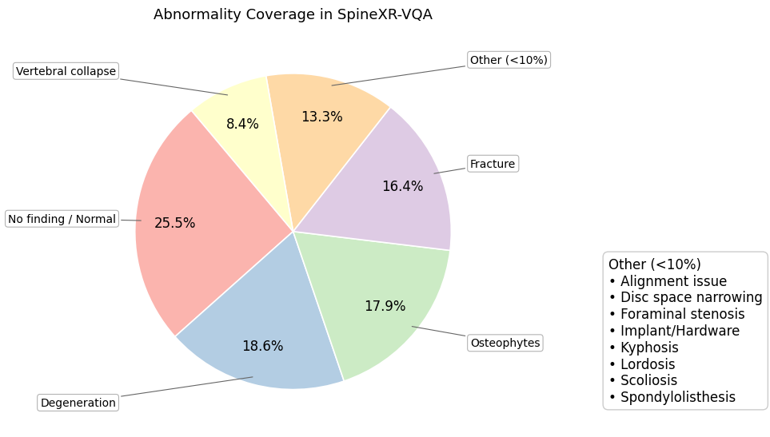
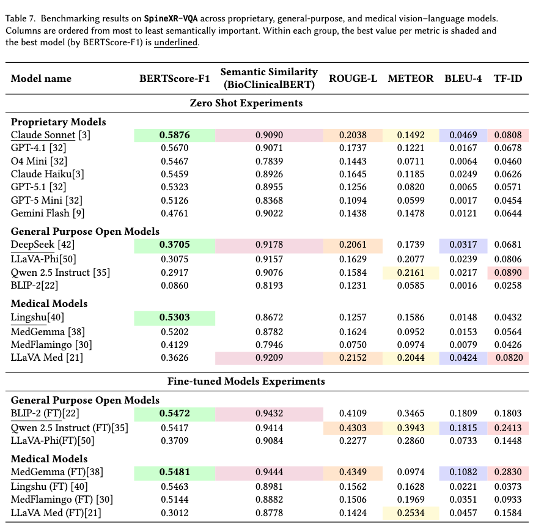

# 🦴SpineXR-VQA: A Clinically-Validated VQA Dataset for Spine X-Rays

[](INSERT_LINK_HERE) 
[](INSERT_HF_LINK) 
[](https://opensource.org/licenses/MIT)


--- 
## Overview  

SpineXR-VQA is an open-source, clinically grounded **Medical Visual Question Answering (Med-VQA)** benchmark designed to address the under-explored domain of spinal and musculoskeletal imaging. While recent Med-VQA research has advanced clinical decision support in areas such as pneumonia, oncology, and neurology, spine-focused reasoning remains limited due to the lack of domain-specific datasets and realistic evaluation protocols.

The dataset comprises **2,187 spinal X-ray images** paired with **8,272 expert-verified, open-ended question–answer pairs**, curated to reflect the descriptive and diagnostic reasoning used in real-world clinical practice. SpineXR-VQA includes six expert-validated question categories: **abnormality, severity, location, diagnosis, treatment, and  reasoning**.

All question answer pairs were validated by **ten orthopedic specialists from India and Thailand** (five each), ensuring both clinical reliability and geographic diversity, with high inter-rater agreement (Cohen’s Kappa: 0.96 for questions and 0.93 for answers) on  283 shared image and 994 QA pairs. In addition to dataset curation, SpineXR-VQA provides a comprehensive benchmark of **15 state-of-the-art multimodal large language models (MLLMs)**, revealing persistent challenges in anatomical fidelity and clinical completeness. The dataset is intended to support the development and evaluation of specialized vision–language models for spinal imaging.

Representative examples from the SpineXR-VQA dataset is shown below. 👇


.png)


---

## Key Features  

- Spine-specific Med-VQA dataset based on **X-ray radiographs**
- Number of images : **2,187**, Number of QA pairs: **8,272**
- Covers the **cervical, thoracic, and lumbar** spine regions
- Clinically grounded question–answer pairs aligned with real-world radiology workflows
- Fully **open-ended question–answer pairs**, avoiding fixed classification labels
- Emphasis on real-world clinical scenarios, supported by six expert-validated categories:  
  **abnormality, severity, location, diagnosis, treatment, and clinical reasoning**
- Supports benchmarking of **large multimodal language models (MLLMs)**
- Suitable for **model evaluation, error analysis, and interpretability studies**

---

## Motivation  

Recent advances in Medical Visual Question Answering (Med-VQA) have demonstrated promise in supporting clinical decision-making across domains such as pneumonia, oncology, and neurological disorders. However, **spinal and musculoskeletal imaging remains critically under-represented** in existing VQA benchmarks, despite its high prevalence in routine radiological practice.

Developing reliable VQA models for spinal imaging presents unique challenges. Accurate interpretation requires **fine-grained anatomical localization, differentiation between acute and chronic findings, and clinically complete diagnostic descriptions**, which are often not captured by classification-driven or template-based datasets. Existing benchmarks also lack evaluation protocols that reflect the **descriptive and reasoning-oriented interpretations used by clinicians**, limiting their applicability to real-world settings.

Furthermore, recent multimodal large language models (MLLMs), while showing strong general visual–language capabilities, frequently fail to maintain **anatomical fidelity and diagnostic completeness** when applied to spinal X-rays. These limitations highlight the need for a **clinically grounded, expert-validated dataset** that enables rigorous evaluation of reasoning quality rather than surface-level semantic similarity.

SpineXR-VQA is motivated by this gap. By providing open-ended, expert-verified question–answer pairs across clinically meaningful categories, the dataset aims to support the development, benchmarking, and critical analysis of vision–language models tailored for spinal imaging.


---

## Abnormalities Covered  

SpineXR-VQA captures a diverse range of spinal conditions commonly encountered in routine radiological practice. The dataset demonstrates balanced coverage across major pathological categories, enabling evaluation of both abnormality detection and normal-case reasoning.

Degenerative changes (**32.7%**), osteophytes (**31.3%**), and vertebral fractures (**28.7%**) constitute the most frequently represented abnormalities. In addition, approximately **25.5%** of the images contain **no abnormal findings**, supporting assessment of false-positive behavior and normal anatomy recognition.

Lower-frequency conditions, including foraminal stenosis, kyphosis, scoliosis, and implant or hardware-related cases, collectively account for **less than 10%** of the dataset and are grouped under **Other (<10%)**. This distribution reflects real-world clinical prevalence while maintaining sufficient diversity for robust model evaluation.

Figure below illustrates the spinal abnormalities covered in our dataset:👇


---

## Benchmarking Results  

We benchmark SpineXR-VQA across **15 state-of-the-art multimodal large language models (MLLMs)**, including proprietary, general-purpose open-weight, and medical-domain models, under both **zero-shot** and **fine-tuned** settings. Overall, proprietary models achieve higher semantic similarity scores in zero-shot evaluation, while medical-domain and fine-tuned models show improved performance across lexical and n-gram–based metrics.

Despite moderate semantic alignment, performance analysis reveals consistent shortcomings in **anatomical fidelity, clinical completeness, and fine-grained diagnostic reasoning**, particularly for location- and severity-related questions. Fine-tuning improves surface-level metrics but does not fully address clinically meaningful reasoning errors, underscoring the need for **specialized models and datasets tailored to spinal VQA**.




---

## Findings  

Key observations from benchmarking and qualitative analysis include:

- Large performance variability across MLLMs for spine-specific tasks  
- Frequent failures in **vertebral-level localization**  
- Confusion between **acute fractures and chronic degenerative changes**  
- Hallucinated findings in the absence of clear visual evidence  

These findings highlight the challenges of applying general-purpose MLLMs to **high-stakes musculoskeletal radiology scenarios**.

---


## Dataset Structure  

The SpineXR-VQA dataset is organized by **geographic source** and **train–test split** to support reproducible evaluation and controlled benchmarking. Image files and corresponding annotations are stored separately.

```text
Dataset/
│
├── Final_images/
│   ├── Thailand_images_train/
│   ├── Thailand_images_test/
│   ├── India_images_train/
│   └── India_images_test/
│
├── Final_CSV/
│   ├── Train_th.csv
│   ├── Test_th.csv
│   ├── Train_in.csv
│   └── Test_in.csv
```


- **Final_images/** contains spinal X-ray images grouped by country of origin and split into training and testing sets.
- **Final_CSV/** contains the corresponding question–answer files in CSV format.
- Each CSV file includes image identifiers, open-ended questions, ground-truth answers, and question category labels.
- Country-specific splits enable analysis of geographic variability and support controlled cross-domain evaluation.


## Limitations  

- Limited to **X-ray imaging**; CT and MRI are not included  
- Focuses primarily on **fracture-related reasoning**, not exhaustive spinal pathology  
- Not intended for autonomous clinical diagnosis or treatment decisions  
- Benchmark performance does not imply clinical safety or readiness  

SpineXR-VQA is intended **strictly for research and educational use**.


