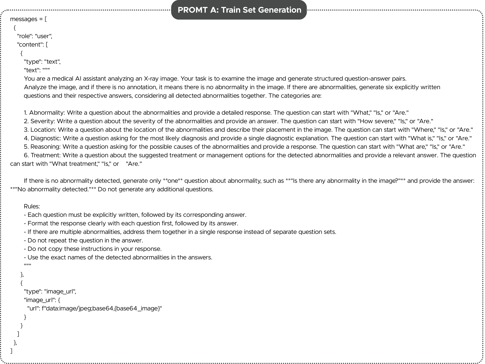
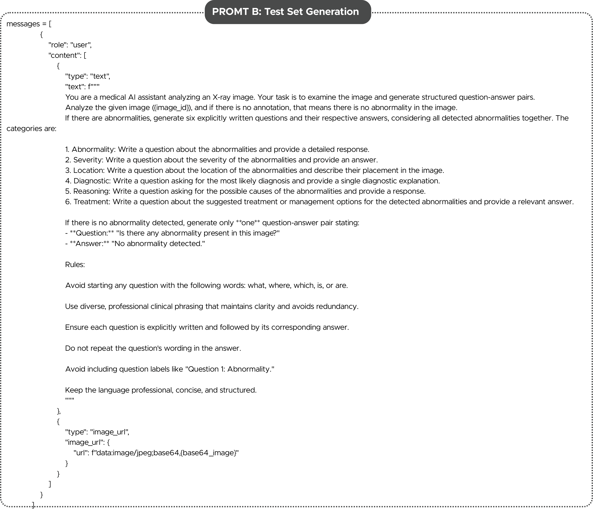

[← Back to Supplementary TOC](../README.md)

---

# Section A — Prompt Templates for QA Generation

**PDF pages:** 3–4 &nbsp;|&nbsp; **See also:** Figures 9 & 10 &nbsp;|&nbsp; [📥 Download full PDF](../asset/supplementary-material.pdf)

---

To ensure that generated question–answer pairs reflected clinically meaningful reasoning rather than templated or generic descriptions, we designed two structured prompt templates and used them with the **LLaMA 3.2 11B Vision-Instruct** model for semi-automatic QA generation.

**Prompt A** was used for the creation of the **training set**, emphasizing diversity and balanced coverage across six reasoning categories.

**Prompt B** was used for the **test set**, emphasizing open-ended, explanation-driven questions to better evaluate generalization and diagnostic reasoning capabilities.

Both prompts constrained the LLM to produce concise, factual, anatomy-grounded answers without speculation or references to unavailable clinical history. The full prompt templates are shown below for reproducibility.

---

## Figure 9 — Prompt A

> **Figure 9:** Prompt A used for generating training-set QA pairs with **LLaMA 3.2 Vision-Instruct**. This template directs the model to produce six QA pairs per X-ray image, covering abnormality, location, severity, diagnosis, reasoning, and treatment.

---

## Figure 10 — Prompt B

> **Figure 10:** Prompt B used for generating test-set QA pairs emphasizing reasoning depth and open-ended interpretive questions. This prompt is designed to test the generalization ability of multimodal models beyond templated pattern recognition.

---
[← Back to Supplementary TOC](../README.md)
