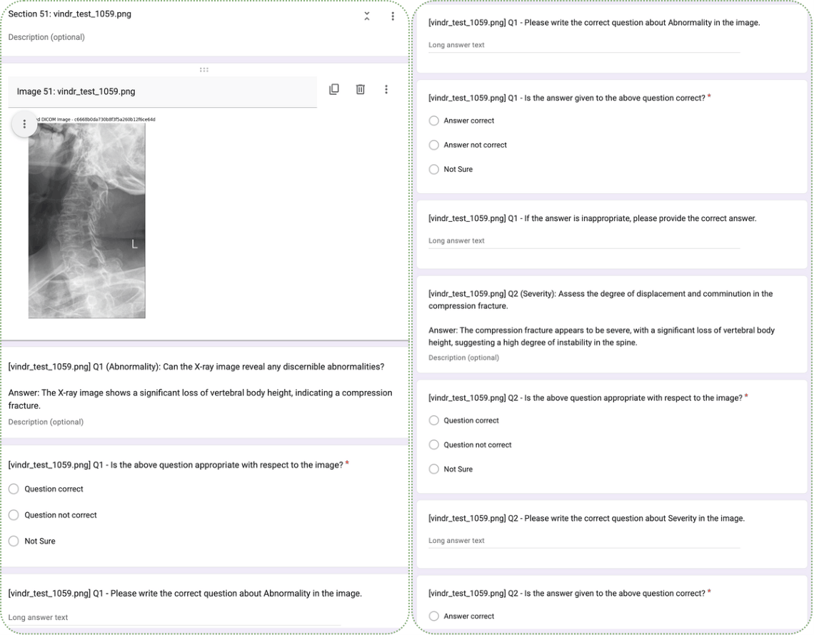
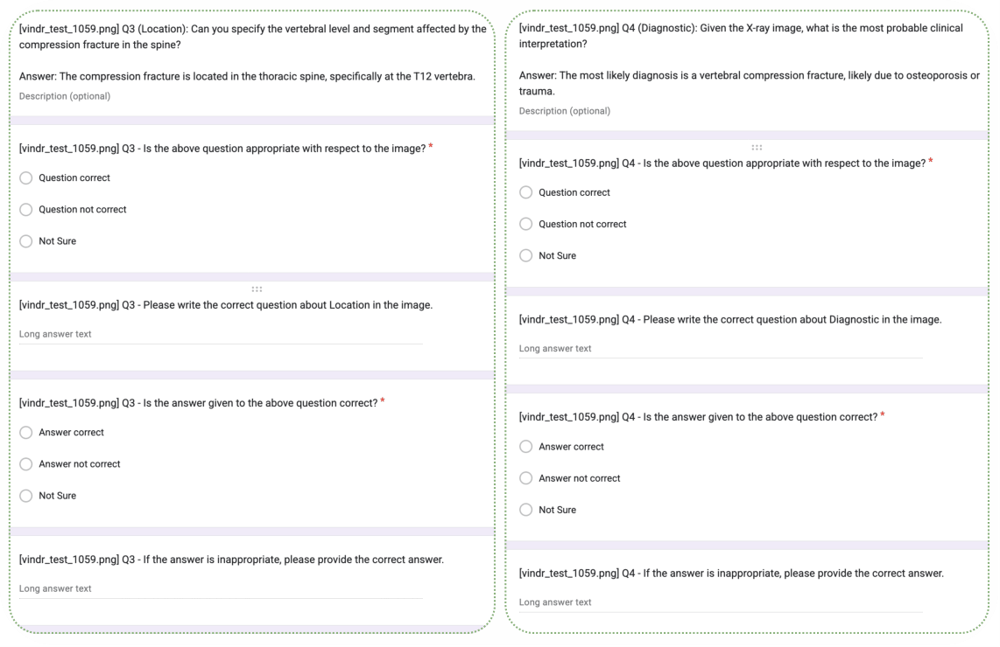

[← Back to Supplementary TOC](../README.md)

---

# Section D — Clinician Validation Form

**PDF pages:** 5, 8 &nbsp;|&nbsp; **See also:** Figure 11 &nbsp;|&nbsp; [📥 Download full PDF](../asset/supplementary-material.pdf)

---

To evaluate the SpineXR-VQA dataset, we developed a structured Google Form interface that enables experts to systematically assess generated question–answer pairs alongside their corresponding spine radiographs (Figure 11). For each image, annotators first evaluate the clinical appropriateness of the question and subsequently assess the correctness of the answer based on visual evidence. To support high-quality annotation, the interface provides a *Not Sure* option for ambiguous cases and free-text fields for annotators to supply corrected questions or answers when errors are identified. This uniform validation framework, applied across all six QA categories, facilitates both quantitative analysis (e.g., inter-annotator agreement) and qualitative error inspection.

---

## Figure 11 — Google Form Excerpt

> **Figure 11:** Excerpt of the Google Form used for clinical validation. Each form presents a spine X-ray image along with generated question–answer pairs. Clinicians assess the correctness of each question and answer using structured options (*Correct*, *Not Correct*, *Not Sure*) and provide corrections when necessary.

---

[← Back to Supplementary TOC](../README.md)
