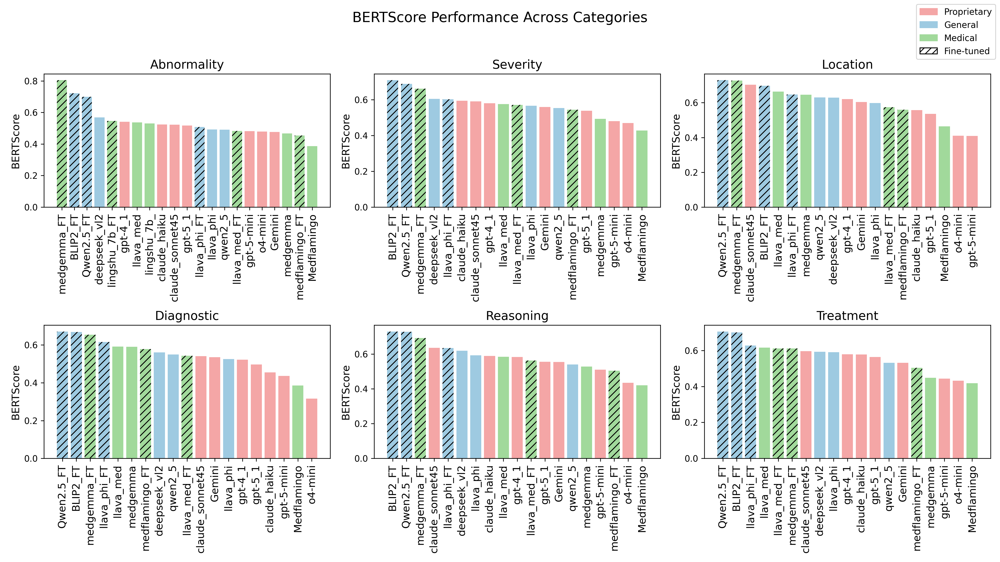
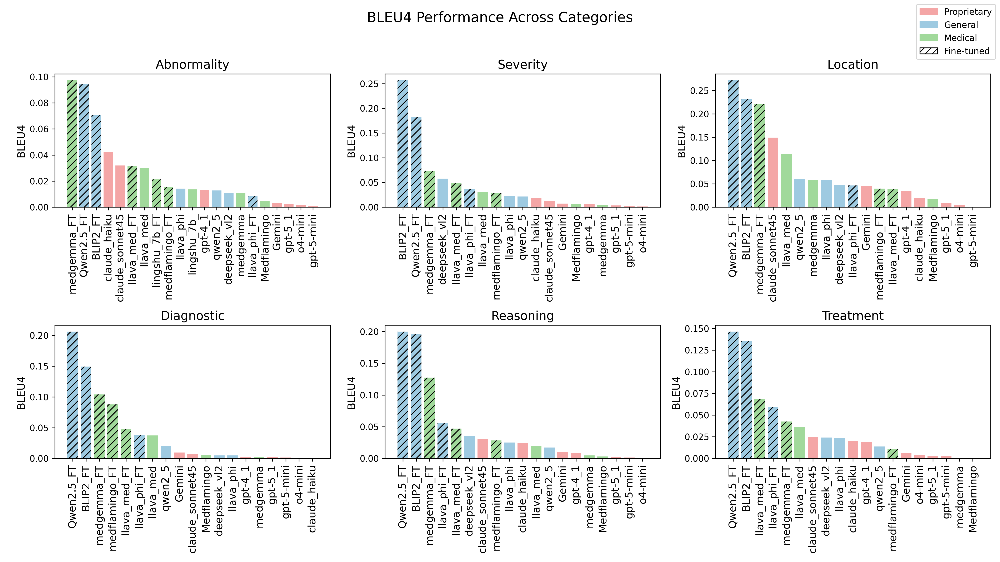
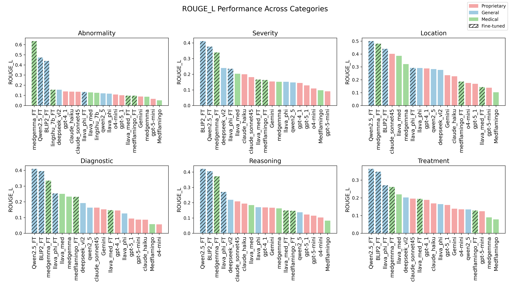
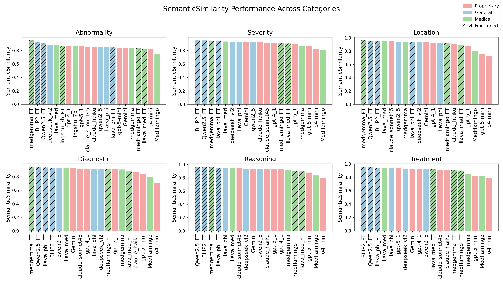
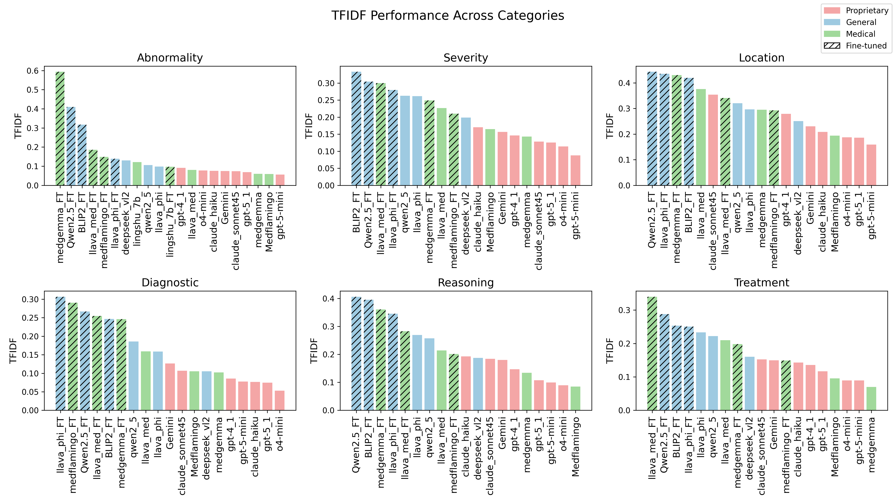

[← Back to Supplementary TOC](../SUPPLEMENTARY_README.md)

---

# Section G — Category-wise Evaluation Across Metrics

**PDF pages:** 38–49 &nbsp;|&nbsp; **See also:** Figures 12–16 &nbsp;|&nbsp; [📥 Download full PDF](../asset/supplementary-material.pdf)

---

We present category-wise performance across six clinical categories (*Abnormality, Severity, Location, Diagnostic, Reasoning, Treatment*) using multiple evaluation metrics. Models are grouped into *Proprietary*, *General-purpose*, and *Medical-specific*, with fine-tuned variants indicated using hatched patterns.

---

## G.1 BERTScore

> **Figure 13:** BERTScore across clinical categories.

BERTScore results indicate strong performance across all categories, with general-purpose and medical models consistently ranking among the top. Fine-tuning does not exhibit a uniform trend; while several fine-tuned models achieve top performance, others show comparable or slightly lower scores relative to their base variants. Across categories, performance is highest for *Abnormality*, *Severity*, and *Location*, with a mild decline observed in *Reasoning* and *Treatment*.

---

## G.2 BLEU-4

> **Figure 14:** BLEU-4 across clinical categories.

BLEU-4 scores are low across all categories, reflecting limited lexical overlap in generated responses. General-purpose models, particularly some fine-tuned variants, achieve the highest scores, while medical models show competitive performance in *Abnormality* and *Reasoning*. Proprietary models consistently rank lower across categories. Fine-tuning exhibits a model-dependent effect, with improvements observed in some cases but no consistent trend across all models. Performance is relatively higher in *Severity*, *Location*, and *Diagnostic*, and drops for *Reasoning* and *Treatment*.

---

## G.3 ROUGE-L

> **Figure 15:** ROUGE-L across clinical categories.

ROUGE-L shows moderate performance across categories, capturing partial structural overlap between predictions and references. General-purpose models consistently achieve the highest scores, with several fine-tuned variants among the top performers. Medical models demonstrate competitive performance, particularly in *Abnormality* and *Severity*, while proprietary models generally rank lower. The impact of fine-tuning is model-dependent, with improvements observed in some cases but no consistent trend across all models. Performance is stronger in *Severity*, *Location*, and *Diagnostic*, and declines for *Reasoning* and *Treatment*.

---

## G.4 Semantic Similarity

> **Figure 12:** Semantic similarity across clinical categories.

Semantic similarity scores are consistently high across all models and categories, indicating strong overall alignment in meaning between predictions and references. Differences between model groups are relatively small; however, general-purpose and medical models slightly outperform proprietary models in most categories. Fine-tuning shows minimal and model-dependent impact, with several fine-tuned models appearing among the top performers without a consistent trend. Performance remains uniformly strong across categories, with only slight reductions observed in *Treatment* and *Reasoning*.

---

## G.5 TF-IDF Similarity

> **Figure 16:** TF-IDF similarity across clinical categories.

TF-IDF similarity shows moderate performance with clearer separation between model groups compared to embedding-based metrics. General-purpose and medical models consistently achieve higher scores across most categories, while proprietary models rank lower. Fine-tuned models frequently appear among the top performers, although the impact of fine-tuning remains model-dependent. Performance is relatively stronger in *Severity*, *Location*, and *Diagnostic*, and declines for *Reasoning* and *Treatment*, reflecting reduced term overlap in more complex responses.

---

[← Back to Supplementary TOC](../SUPPLEMENTARY_README.md)
